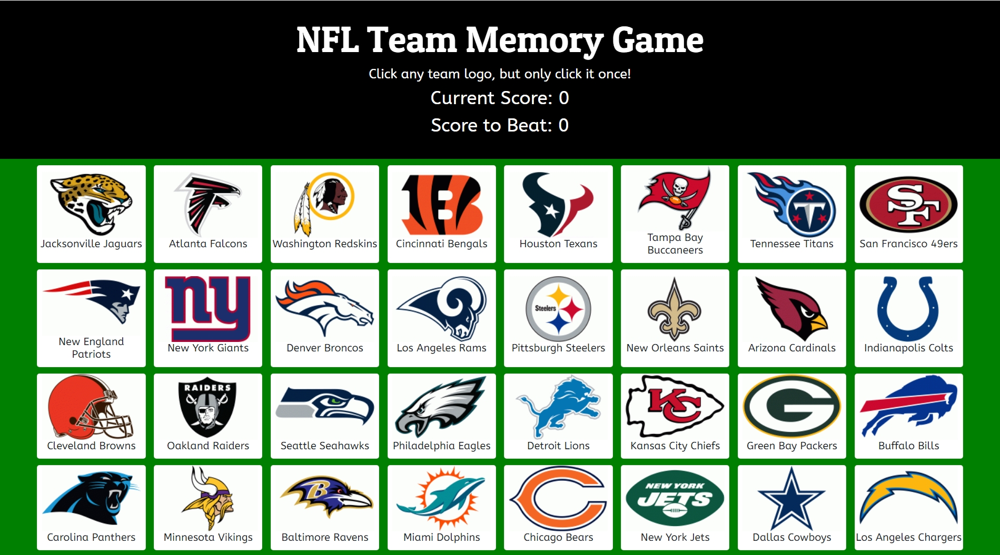

# Clicky-Game

## Overview

This is a NFL themed memory game using React. The application's UI is split into three components.

## Instructions

1. Create a new React application using Create React App.

2. The app will render 32 different NFL logo images to the screen. Each image will listen for click events.

3. The app will keep track of the user's score. The user's score will increment when clicking an image for the first time. The user's score will reset to 0 if they click the same image more than once.

4. Every time an image is clicked, the images rendered to the page will shuffle themselves in a random order.

5. Once the user's score is reset after an incorrect guess, the game will restart.

## Technologies Used

* React
* ES6
* Bootstrap
* CSS

## Website

https://kpatel1209.github.io/React-Clicky-Game/

## Copyright

Kevin Patel © 2019.  All rights reserved.
